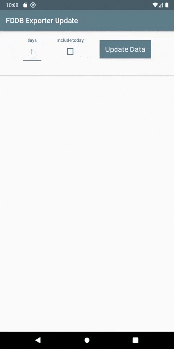

# FDDB Exporter Control

This is a Flutter application to control my backend
service [FDDB Exporter](https://github.com/itobey/fddb-exporter).

As I often forget to enter all the meals consumed throughout the day, the nightly export of the
backend service misses the data when I enter the data the next day. Although an endpoint for this
use case already exists, I need to use a HTTP client to send the `POST` request with the payload to
the service. This is quite impractical and thus the idea was born to create a mobile application for
this and I got to learn about Flutter and mobile app development.

See my [blog post](https://itobey.dev/index.php/building-a-mobile-app-with-flutter-for-the-fddb-exporter-backend/) for details.

## Demo

  

## Prerequisites

- a running instance of the backend
  service [FDDB Exporter](https://github.com/itobey/fddb-exporter) (needs to be v0.2 or newer)
- a working [Flutter SDK and environment](https://docs.flutter.dev/get-started/install/windows)

## Usage

If everything is set up the only necessary action is to configure your backend service endpoint
in `lib/config.dart`. Then just build the application using `flutter build apk` or run it on an
emulator.

## Issues

On Windows the `ScrollView` does not work for some reason so not all stats can be displayed by the
user (except when the width of the window is large enough). As I'm only using it on Android where
everything works this is not a concern to me.
